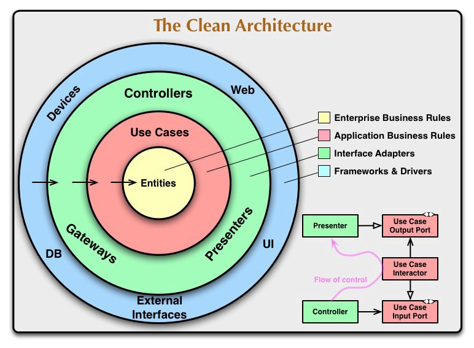

# HepsiExpress-Challenge
HepsiExpress-Challenge Mobile App

A Github HepsiExpress ® Interview App illustrating current Android Architecture state using Android development best
practices.

Introduction
------------
The application uses Clean Architecture based on MVVM and Kotlin. Implemented
Architecture principles follow Google recommended [Guide to app architecture](https://developer.android.com/jetpack/docs/guide).




## ✍️ Author

👤 **developersancho**

* Github: <a href="https://github.com/developersancho" target="_blank">@developersancho</a>
* Email: developersanchez1903@gmail.com

Feel free to ping me 😉

## ☑️ TECH STACKS

- Kotlin
- MVVM
- Clean Architecture
- Multi-Module
- ViewBinding
- Material Components
- Navigation Component
- Lifecycles
- Coroutines
- Flow
- Retrofit-Okhttp with Coroutines
- Moshi
- Koin For DI
- Glide for show image
- Gradle Kotlin DSL(buildSrc) for dependency management
- Unit Test for Data and Domain Modules


## 📝 License

```
Copyright © 2021 - developersancho

Licensed under the Apache License, Version 2.0 (the "License");
you may not use this file except in compliance with the License.
You may obtain a copy of the License at

   http://www.apache.org/licenses/LICENSE-2.0

Unless required by applicable law or agreed to in writing, software
distributed under the License is distributed on an "AS IS" BASIS,
WITHOUT WARRANTIES OR CONDITIONS OF ANY KIND, either express or implied.
See the License for the specific language governing permissions and
limitations under the License.
```
